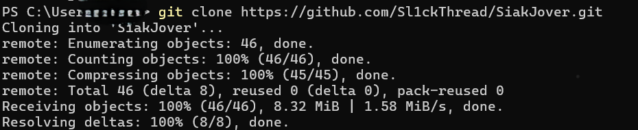

# SiakJover

**Sick of losing the battle? Still fighting manually with `Ctrl+F` and endless scrolling?** 😫 <br> Fear not! <br> SiakJover is here to streamline your war with minimal effort. Just make sure you have a decent internet connection! 😄

## Setup Instructions

### 1. Download Required Files

   - **Get Python**: This code runs on Python, so you'll need to have it installed. If you don’t have it, download it from https://www.python.org/downloads/. An IDE is a bonus but not required.
   - **Download SiakJover**: You can clone the repository (use terminal) or download the ZIP file.
```
git clone https://github.com/Sl1ckThread/SiakJover.git
```


   - **Open Terminal** : Open command prompt or terminal depending on your operating system
   - **Navigate to the Folder**: Open your command prompt (Windows) or terminal (macOS/Linux) and change the directory to your SiakJover folder using:

```
cd path_to_your_siakjover_folder
```


### 2. Install Required Python Libraries

   You’ll need a couple of Python libraries. Run the following commands in your command prompt or terminal:
```
pip install selenium
```
```
pip install tkinter
```
   Add `--user` behind it if you encounter error installing the library

### 3. Configure the `config.txt` File

   Open the `config.txt` file and update it with your username, password, and subject codes in the following format:
```
   username: your_username
   password: your_password
   matkul_code:
   code1
   code2
```   

### 4. Run the Program

   - Execute the program using the command:
```
     python siakjover.py
```
### 5. Follow the Prompts

   - The program will automatically open a browser window and try to log in using the credentials from `config.txt`.
   - It will then navigate to the course selection page and start selecting subjects based on the codes you provided.
   - If there are issues with logging in or finding subjects, the program will show error messages.

## Troubleshooting

- **Login Issues**: Verify that your username and password in `config.txt` are correct. Ensure your internet connection is stable.
- **Browser Issues**: Make sure Chrome and ChromeDriver are properly installed and up-to-date.
- **Non-Windows Users**: If you're not on Windows, download the correct version of ChromeDriver for your operating system (Linux/macOS). Place the ChromeDriver executable in the SiakJover folder and, if needed, the testground folder for testing purposes.
- **Program Errors**: If an error occurs, it will be printed in the console. Check these messages for guidance.

## Credits

I took inspiration from the legendary Co-author SiakTzu, Hocky, Dennis and Galang. I have modified their codes to my liking.  

## Contact

For further assistance, text me via discord sl1ckthread
