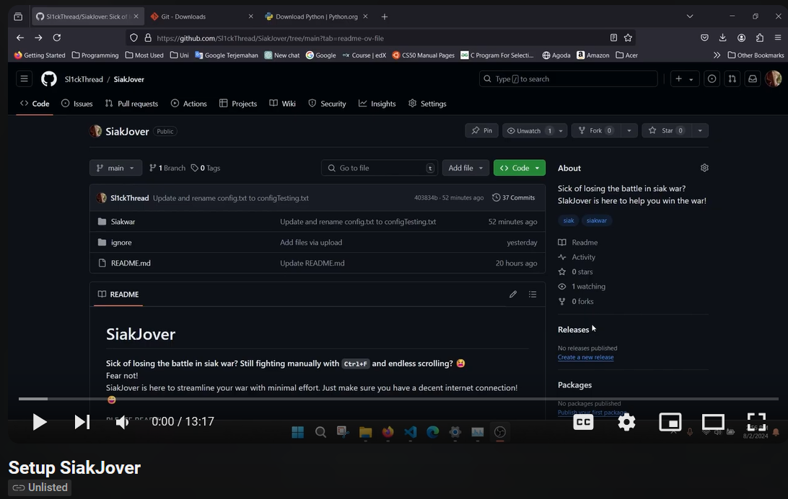
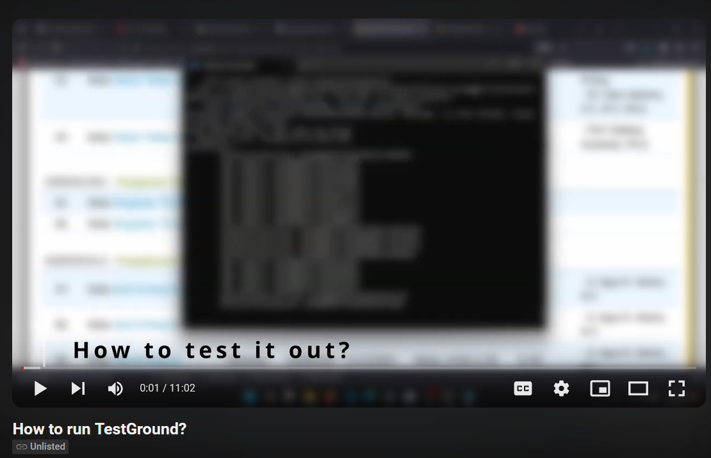
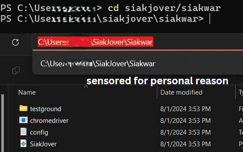
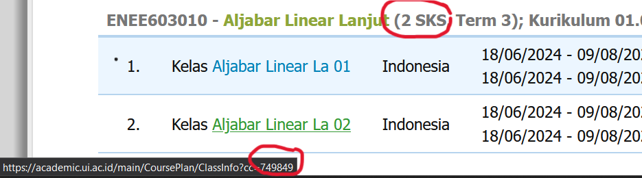

# SiakJover

**Sick of losing the battle in siak war? Still fighting manually with `Ctrl+F` and endless scrolling?** 😫 <br> Fear not! <br> SiakJover is here to streamline your war with minimal effort. Just make sure you have a decent internet connection! 😄

PLEASE READ!!!!

## Setup Instructions

###Lazy to read allat? This video should help you

**How to setup SiakJover?**
Side note: I forgot to mention that if you have a different operating system (not windows), please replace the `chromedriver` inside the folder (both siakwar and inside testground) <br> https://googlechromelabs.github.io/chrome-for-testing/

(https://www.youtube.com/watch?v=UmlMUOUMTCo)

**How to run TestGround?**

(https://www.youtube.com/watch?v=tjLuujhlNpY)

### 1. Download Required Files

   - **Get Python**: This code runs on Python, so you'll need to have it installed. If you don’t have it, download it from https://www.python.org/downloads/. An IDE is a bonus but not required.
   - **Download SiakJover**: You can clone the repository (You will need to download git for it https://git-scm.com/downloads. PLEASE download based on your OS) or download the ZIP file (dm me via discord if enconter problem, sl1ckthread) 
```
git clone https://github.com/Sl1ckThread/SiakJover.git
```


   - **Open Terminal** : Open command prompt or terminal depending on your operating system
   - **Navigate to the Folder**: Open your command prompt (Windows) or terminal (macOS/Linux) and change the directory to your SiakJover folder using:

```
cd siakjover/siakwar
```


### 2. Install Required Python Libraries

   You’ll need a couple of Python libraries. Run the following commands in your command prompt or terminal:
```
pip install selenium
```
   Add `--user` behind it if you encounter error installing the library

### 3. Configure the `config.txt` File

   Open the `config.txt` file and update it with your username, password, and subject codes. You can find it by going to the directory  stated on the terminal
   


   To find the matkul code you are looking forward can be found by hovering the subject you want
   


   On the config.txt, you will be asked for matkulcode. To clarify, based on the picture above `749849` is the value you found on the picture above and `-2` is the sks

### 4. Run the Program

   - Execute the program using the command:
```
     python siakjover.py
```
`If you are NOT on windows`, please download the correct chromedriver based on your operating system (linux/mac) on https://googlechromelabs.github.io/chrome-for-testing/
<br> Replace the current chromedriver in the folder with the one you installed (also on testground)
### 5. Follow the Prompts

   - The program will automatically open a browser window and try to log in using the credentials from `config.txt`.
   - It will then navigate to the course selection page and start selecting subjects based on the codes you provided.
   - If there are issues with logging in or finding subjects, the program will show error messages.
   - After the codes have been selected, it will auto submit. `If codes isnt found, it will not auto submit`
   - CTRL+C to stop the program entirely 
   

## Whatsupp with testground?

I have created a specific folder for you to test the code. Please make sure to edit the `config.txt` file INSIDE the testground folder as needed. Then, navigate to the testground directory in your terminal by running `cd testground`, and execute the script with `python siakjover.py`.

To test the changes for the matkul code, run the Python file first and hover over the desired matkul code you want to test.

## Warnings!!

Do not `Go back one page` or you will break the program

## Troubleshooting

- **Login Issues**: Verify that your username and password in `config.txt` are correct. Ensure your internet connection is stable.
- **Browser Issues**: Make sure Chrome and ChromeDriver are properly installed and up-to-date.
- **Non-Windows Users**: If you're not on Windows, download the correct version of ChromeDriver for your operating system (Linux/macOS). Place the ChromeDriver executable in the SiakJover folder and, if needed, the testground folder for testing purposes.
- **Program Errors**: If an error occurs, it will be printed in the console. Check these messages for guidance.
- **Terminal Errors** : If for somewhat reason your terminal went stuck and unable to load and want to restart the program, press `Ctrl+C` on the terminal to keyboardinterrupt

## Credits

I took inspiration from the legendary Co-author SiakTzu, Hocky, Dennis and Galang. I have modified their codes to my liking.  

## Contact

For further assistance, text me via discord sl1ckthread
